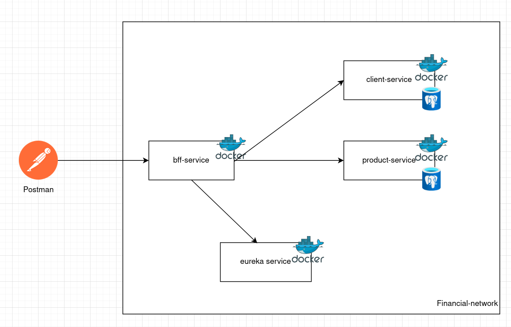

# 🏦 Financial Services API – Microservicios

## 📋 Descripción general

Este proyecto implementa una arquitectura de microservicios para la gestión de clientes y sus productos financieros.  
La solución cumple con los requerimientos de autenticación OAuth2 (Keycloak), encriptación de datos, comunicación reactiva con Spring WebFlux, y despliegue en contenedores Docker.

---

## 🚀 Arquitectura general

### 🔹 Componentes principales
- **client-service** → Gestiona la información del cliente.
- **product-service** → Gestiona la información de los productos financieros.
- **bff-service** → Actúa como Backend For Frontend; integra ambos servicios y expone la API unificada.
- **keycloak** → Servidor de identidad para autenticación OAuth2.
- **eureka-server** → Registro de servicios y descubrimiento dinámico.
- **PostgreSQL** → Base de datos relacional.

---

### 🧱 Diagrama de arquitectura



🧩 Todos los servicios están conectados dentro de una red interna de Docker, donde **solo el BFF expone su puerto al exterior.**

---

## ⚙️ Tecnologías utilizadas

| Componente | Tecnología |
|-------------|-------------|
| Lenguaje | Java 17 |
| Framework | Spring Boot 3, Spring WebFlux |
| Seguridad | Spring Security + OAuth2 (Keycloak) |
| Registro y Descubrimiento | Spring Cloud Netflix Eureka |
| Base de datos | PostgreSQL |
| ORM / Reactive | Spring Data R2DBC |
| Docker | Docker Compose |
| Mapeo DTOs | MapStruct |
| Logs | Logback + AOP |
| Documentación API | OpenAPI / Swagger |
| Test | JUnit 5 |

---

## 🧩 Diseño y patrones aplicados

- **BFF Pattern (Backend For Frontend)** → Centraliza la comunicación entre front y microservicios.
- **Service Discovery** → Eureka gestiona el registro dinámico de servicios.
- **Reactive Streams** → Comunicación no bloqueante con `WebFlux`.
- **AOP (Aspect-Oriented Programming)** → Para logging y tracking de peticiones.
- **SOLID y patrones de diseño**:
    - S → Responsabilidad única en cada microservicio.
    - O → Abierto a extensión mediante interfaces y MapStruct.
    - L/I/D → Aplicados mediante interfaces, DTOs y capas separadas.

---

## 🔐 Seguridad con Keycloak

### Configuración básica:
- Realm: `financial-services`
- Client: `bff-client`
- Roles: `user`, `admin`
- Endpoint JWT: `http://keycloak:8080/realms/financial-services`

📘 **Flujo:**
1. Obtener token con usuario válido en Keycloak.
2. Enviar el token en el `Authorization: Bearer <token>` al endpoint del BFF.
3. Spring Security valida el `issuer-uri` y el token JWT.

---

## 🧮 Encriptación del código único

El BFF recibe un `codigoUnico` encriptado → lo desencripta usando un componente `EncryptionService` (basado en AES o BCrypt) antes de consultar los microservicios.  
Este proceso está registrado mediante **AOP LoggingAspect**.

---

## 🧰 Ejecución del proyecto

### 🔹 Requisitos previos
- Docker y Docker Compose instalados.
- Puerto 8080 libre para Keycloak y 8083 para el BFF.

### 🔹 Comandos

```bash
# Construir las imágenes
.mvn clean package -DskipTests

# Levantar toda la arquitectura
docker compose up --build
```

## 🧩 Tracking

Cada petición genera un ID de tracking único (UUID) en el BFF, propagado mediante RequestInterceptor hacia todos los microservicios, visible en los logs (Logback).

## 🧪 Tests

Tests unitarios con JUnit 5.

Mocking de dependencias con Mockito.

Validación de endpoints reactivos con WebTestClient.

## 🧩 Documentación API (OpenAPI)

La API se documenta automáticamente con Swagger UI:
- URL: `http://localhost:8083/docs`

## 📦 Estructura del repositorio
```
financial-services/
├── bff-service/
├── client-service/
├── product-service/
├── eureka-server/
├── docker-compose.yml
└── README.md
```

## 🧠 Mejoras futuras

- CI/CD con GitHub Actions.
- Monitoreo con Prometheus + Grafana.
- Configuración centralizada con Spring Cloud Config.